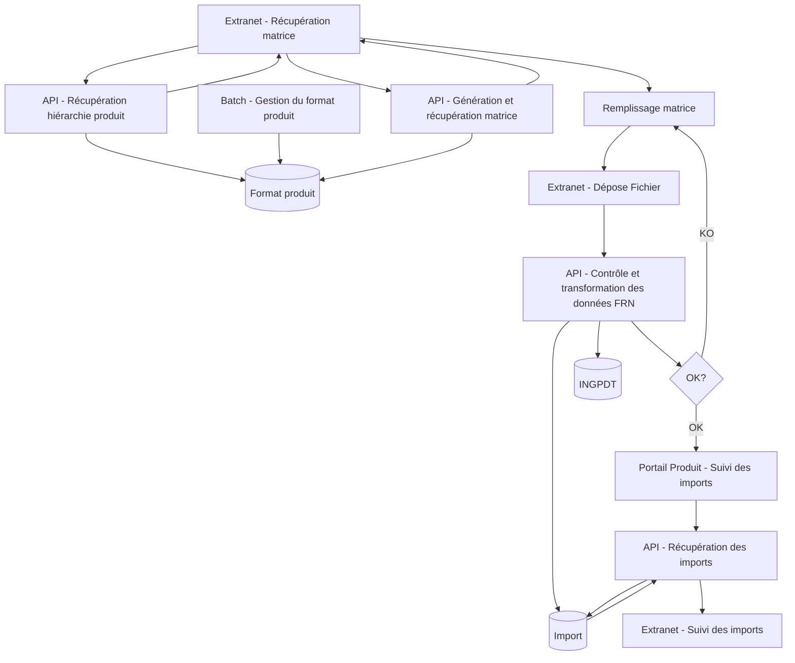
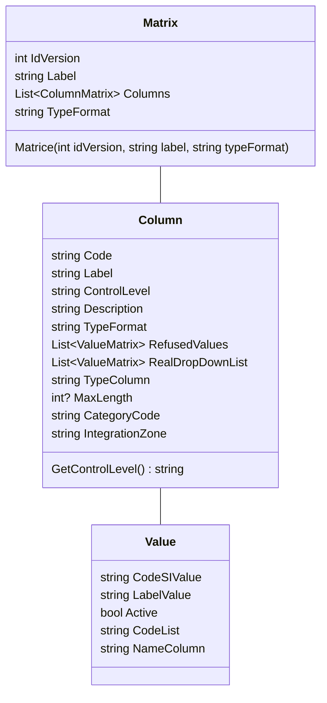
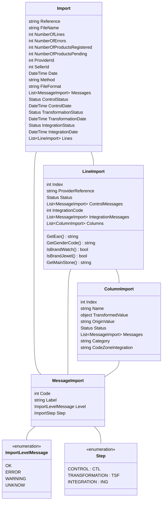

# PIM - Extranet 

## Objectifs

Ce projet a pour but d'automatiser l'ajout d'un nouveau produit par un fournisseur.
 
### A l'origine
A l'origine, on traitait les nouveaux produits à l'aide de Mirakl (via un format produit que l'on lui fournissait). Mirakl générait une nouvelle matrice, le fournisseur la remplissait et le service des achats vérifiait la matrice, remplissait les données Maty avant de la déposer sur Mirakl qui se chargeait de valider la matrice, et de la transformer avec les valeurs du SI maty. Finalement, les achats lançaient l'immatriculation produit via la console.
### Avec le nouveau fonctionnement
- Le fournisseur récupère une matrice vide sur l'extranet fournisseur
- Il remplit la matrice avec les différentes infos du produit à ajouter (il peut renseigner évidemment plusieurs produits
- Il upload la matrice remplie sur l'extranet
- La matrice est vérifiée par l'API portail produit
- Si le fichier est OK, les achats peuvent renseigner les valeurs maty sur le portail produit 
- Dans la page de suivi des imports, le fournisseur peut télécharger son fichier et voir son statut

L'interet du nouveau fonctionnement est que les achats n'ont plus d'actions à faire tant que la matrice n'est pas remplie selon les règles fixées. De plus, on s'affranchit totalement de Mirakl ce qui simplifie le process, et nous permet d'être plus agile.

## Périmètre

### Qui est concerné ? 
Le service achat, et ses fournisseurs

## Flux de données / Workflow

## Classes & Tables
### Classes de Matrice

#### Classes dans le code
Les matrices générées par l'api sont représentées par 3 classes, détaillons les ici : 

On considére la matrice comme une liste de colonnes, qui ont un niveau de contrôle (Obligatoire, Libre...) et une potentielle liste de valeurs. A chaque valeur on a un label, et un codeSI associé. Par exemple la marque `MATY` a un code SI `MA` 
Dans l'API portail produit, ces classes sont utilisées pour générer une nouvelle matrice dans le `PimMatriceService`

#### Tables dans la base

La matrice est représentée par plusieurs tables en base de données.
- Pour lister les versions de la matrice, on a **PIMVER**

| Champ | Type | Description |
| ---------- | ----- | ------------- |
| NOVER | INTEGER | Numéro de version
|CDTYPMTX| CHAR(3) | Code type matrice
| LBVER | VARCHAR(258) | Libellé version
| ONACT | CHAR(1) | Active?
| DTAPPVER | TIMESTMP | Date application
| LBDSCVER | VARCHAR(1026) | Description version

- Pour les catégories de bijoux, elles sont présentes dans **PIMCAT**

| Champ | Type | Description |
| ---------- | ----- | ------------- |
| NOVER | INTEGER | Numéro version
| CDCAT | CHAR(3) | Code catégorie
| NOLBLCAT | INTEGER | Numéro libellé
| CDCATPAR | CHAR(3) | Code catégorie parente
- Pour la liste des colonnes, c'est dans PIMCOL

| Champ | Type | Description |
| ---------- | ----- | ------------- |
| NOVER | INTEGER | Numéro de la version 
| CDCOL | VARCHAR(52) | Code colonne
| CDCAT | CHAR(3) | Code catégorie
| NOLBLCOL | INTEGER | numéro libellé pour le nom de colonne
| NOORDAFI | INTEGER | Numéro pour ordre affichage
| NOLBBLDSC | INTEGER | Numéro label pour la description
| LGMAXCOL | INTEGER | Longueur max. du contenu de la colonne
| LBFRT | VARCHAR(22) | Format (xslx ou csv)
| CDLST | VARCHAR(62) | Code liste associée
| CDTYPCOL | CHAR(3) | Code type colonne (int etc...)
| CDCTLFRN | CHAR(3) | Code controle fournisseur (OBL, LIB...)
| CDCTLMPI | CHAR(3) | Code controle marketplace (OBL, LIB...) 
| ONAFIFRN | CHAR(1) | Est-ce que la colonne est affichée pour une matrice fournisseur
| ONAFIMPI | CHAR(1) | Est-ce que la colonne est affichée pour une matrice Marketplace
| ONCTL | CHAR(1) | Est-ce qu'on contrôle la colonne
| CDZONING | VARCHAR(12) | Le champs dans INGPDT associé à la colonne 
- Pour les listes déroulantes, **PIMLST**

| Champ | Type | Description |
| ---------- | ----- | ------------- |
| NOLBLLST | INTEGER | Numéro label associé
| CDLST | VARCHAR(62) | Code de la liste

- Pour les valeurs présentes dans les listes, **PIMVLR**

| Champ | Type | Description |
| ---------- | ----- | ------------- |
| CDVLRPIM | VARCHAR(12) | Code valeur dans le SI
| NOLBLVLR | INTEGER | Numéro libellé
| CDLST | VARCHAR(62) | Code liste associée
| ONREF | CHAR(1) | Valeur refusée?
| ONACTVLR | CHAR(1) | Valeur active ?
| DHACTVLR | TIMESTMP | Date activation desactivation valeur
| LRUSRACT | VARCHAR(12) | User activation desactivation valeur

Pour chaque label des tables mentionnées, on utilise la table **PIMLBL** (cela nous permet de gérer la traduction de chaque valeur individuellement)
Voici les champs de PIMLBL : 
| Champ | Type | Description |
| ---------- | ----- | ------------- |
| NOLBL | INTEGER | Numéro Libellé
| CDLGE | CHAR(2) | Code langue (FR ou EN)
| LLLBL | VARCHAR(4098) | Libellé traduit

### Classes d'imports
#### Classes dans le code
Pour gérer l'import d'une matrice remplie par un fournisseur, faire le contrôle et intégrer ça dans INGPDT, on utilisera x classes, détaillons les ici : 

Pour un import donné, on a une liste de lignes (1 produit par ligne) et pour chaque ligne on a une liste de colonnes. 
Les colonnes possèdent une valeur d'origine (par exemple MATY) et une valeur transformée (MA pour MATY)
Pour les listes multiples, on a toutes les valeurs séparées par un `|`
Chaque objet possède une liste de messages d'erreurs pour chaque étape du process. C'est en fonctions de ces messages que l'on sait ce qu'il se passe si l'import a échoué.

#### Tables dans la base
L'import est représenté par plusieurs tables en base de données.
- Pour l'import on a la table **PIMIMP**

| Champ | Type | Description |
| ---------- | ----- | ------------- |
| RFIMP | VARCHAR(22) | Référence d'import (généré automatiquement dans le code)
| LBNOMFIC | VARCHAR(514) | Nom du fichier importé 
| NBLIG | INTEGER | Nombre de lignes (produits)
| NOFOU | INTEGER | Numéro fournisseur 
| NOVEN | INTEGER | Numéro vendeur
| CDMTHIMP | CHAR(3) | Méthode import (EXT ou API)
| CDFRTFIC | VARCHAR(6) | Code format fichier (l'extension)
| DHIMP | TIMESTMP | Date de l'import
| LRUSRIMP | VARCHAR(12) | User qui a fait l'import
| CDSTACTL | CHAR(3) | Code statut contrôle 
| DHCTL | TIMESTMP | Date du contrôle
| CDSTATSF| CHAR(3) | Code statut transformation
| DHTSF | TIMESTMP | Date de la transformation
| CDSTAING | CHAR(3) | Code statut intégration
| DHING | TIMESTMP | Date de l'intégration
- Chaque ligne d'import est stockée dans la table **PIMIMPLG**

| Champ | Type | Description |
| ---------- | ----- | ------------- |
| RFIMP | VARCHAR(22) | Référence import
| NOLIGFIC | INTEGER | Numéro de la ligne dans le fichier
| RFPDTFOU | VARCHAR(52) | Référence fournisseur pour le produit (shop-sku)
| RFPDTMTY | VARCHAR(18) | Référence MATY pour le produit
| CDSTACTL | CHAR(3) | Code statut contrôle 
| DHCTL | TIMESTMP | Date du contrôle
| CDSTATSF| CHAR(3) | Code statut transformation
| DHTSF | TIMESTMP | Date de la transformation
| CDSTAING | CHAR(3) | Code statut intégration
| DHING | TIMESTMP | Date de l'intégration

- Chaque colonne est stockée dans **PIMIMPCO**

| Champ | Type | Description |
| ---------- | ----- | ------------- |
## Glossaire
- **Matrice** : Document Excel que le fournisseur rempli, avec toutes les informations d'un produit.
- **Mirakl** : Prestataire de service qui permet de gérer un market place. 
- 
